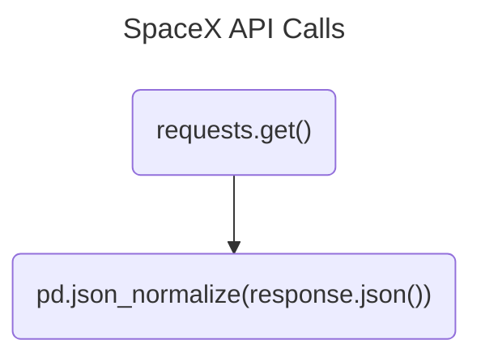
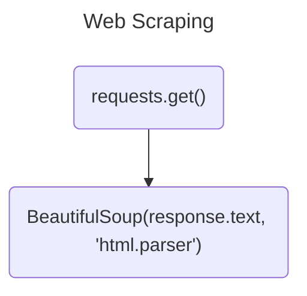

# Coursera-Data-Science-Specialisation
This repository serves the achievement of the IBM Data Science Professional Certificate

# Flowcharts

```mermaid
---
title: SpaceX API Calls
---
flowchart TD
    id1("requests.get()")
    id2("pd.json_normalize(response.json())")
    id1 --> id2

```

```mermaid
---
title: Web Scraping
---
flowchart TD
    id1("requests.get()")
    id2("BeautifulSoup(response.text, 'html.parser')")
    id1 --> id2

```